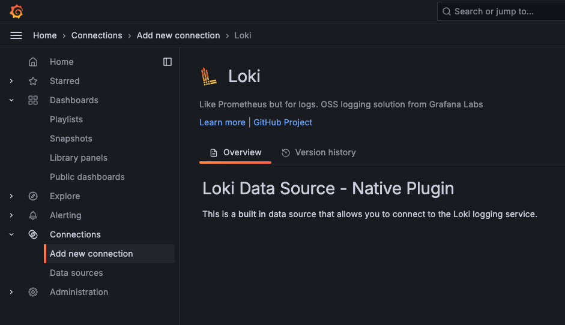
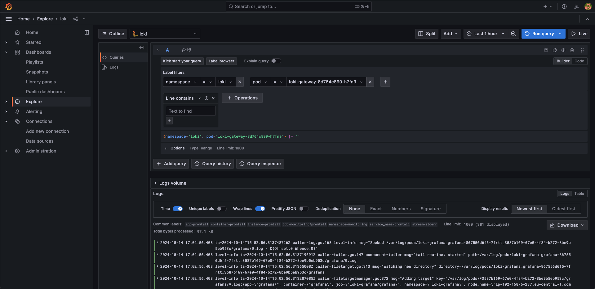

# Loki Deployment on different K8s clusters

## Create an EKS cluster with EBS storage

This is documented in [EKS/README.md](EKS/README.md)

## Deploy Loki

For this simple example I decided to use the `SingleBinary` option to deploy the Loki stack. 

Just started with setting up helm: 

```
helm repo add grafana https://grafana.github.io/helm-charts
helm repo update
```

I created a new namespace for the deployment with `kubectl create namespace loki`

and installed helm chart with `helm install --values values-loki-monolithic.yaml loki --namespace=loki grafana/loki`.

## Run the Promtail client on EKS

Install the deamon-set with `helm install promtail --namespace monitoring grafana/promtail -f values-promtail.yaml`.

## Install Grafana client

Install Grafana with `kubectl apply -f grafana/grafana.yaml --namespace=grafana`.
With `kubectl port-forward service/grafana 3000:3000 --namespace=loki-grafana` you can access Grafana at `http://localhost:3000/login` in your browser.


## Create new Datasource and explore the logs

Now you are ready to create a new Connection in the Grafana UI:

* Connections -> Add new connection -> Loki -> Add new data source (use `http://loki-gateway.loki` for the url)



When the datasource is created you can
 
* switch to Explore
* set label filters (e.g. `namespace`)
* click `Run query`

and check all the logs from containers running in your Kubernetes cluster.



## Links & Documentation

### Loki & Grafana

* [Install the monolithic Helm chart](https://grafana.com/docs/loki/latest/setup/install/helm/install-monolithic/)
* [Run the Promtail client on AWS EKS](https://grafana.com/docs/loki/latest/send-data/promtail/cloud/eks/)
* [Grafana on Kubernetes](https://grafana.com/docs/grafana/latest/setup-grafana/installation/kubernetes/)